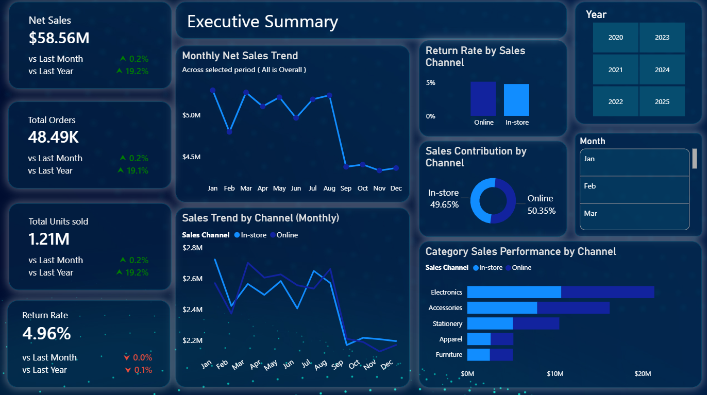
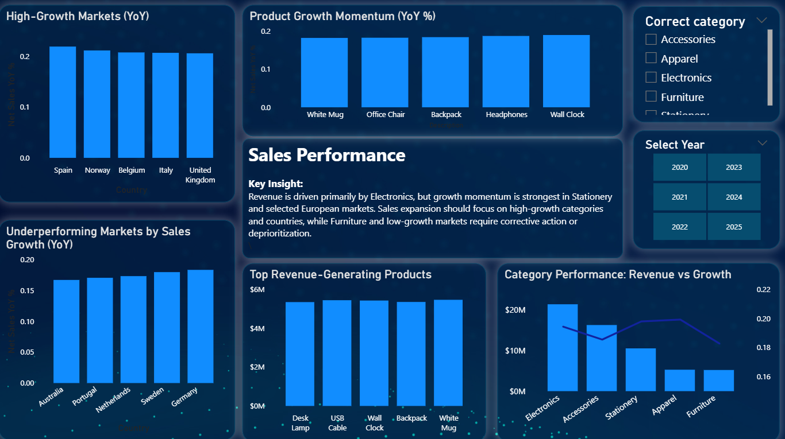
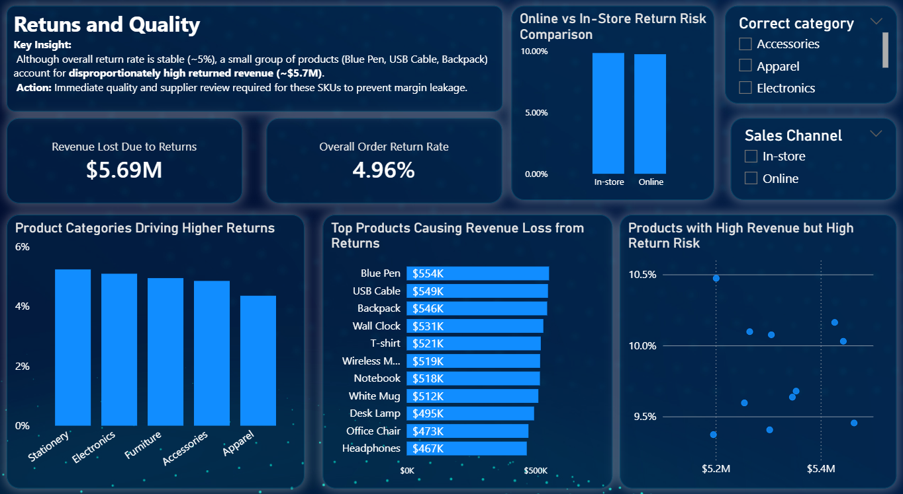
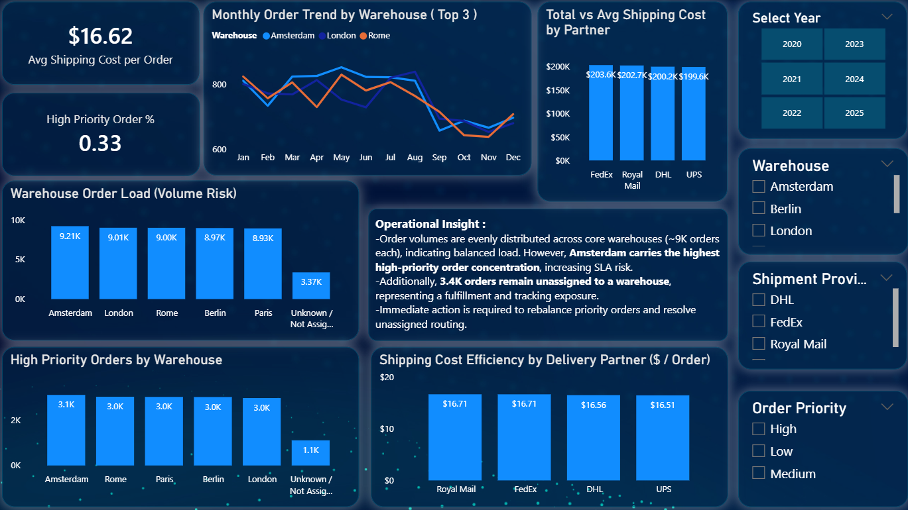

# 📊 Sales Performance & Operations Dashboard (Power BI)

## 🔍 Project Overview
This project analyzes online sales data to identify **revenue risks, return drivers, and operational inefficiencies**.
The objective was not just to build dashboards, but to **answer real business questions and support decision-making**.

---

## 🧠 Business Questions Answered
- Why did sales drop sharply in September?
- Which products are causing the highest revenue loss due to returns?
- Is the online or in-store channel more volatile?
- Which warehouses are at risk of operational overload?
- Are higher shipping costs justified by order volume?

---

## 📈 Dashboard Pages

### 1️⃣ Executive Summary
High-level KPIs with time-based comparisons:
- Net Sales, Total Orders, Units Sold
- Month-over-Month (MoM) and Year-over-Year (YoY) trends
- Sales channel contribution (Online vs In-store)

---

### 2️⃣ Sales Performance Analysis
Performance breakdown across products, categories, and regions:
- Category revenue vs growth
- Top and bottom performing products
- Country-level YoY sales growth

---

### 3️⃣ Returns & Quality Analysis
Focus on identifying revenue leakage from returns:
- Return rate by product category and sales channel
- Returned revenue impact by product
- High-risk products contributing to return losses

---

### 4️⃣ Operations & Logistics
Operational efficiency and cost analysis:
- Warehouse order load and capacity risk
- Shipping cost per order by delivery partner
- High-priority order distribution across warehouses

---

## 💡 Key Insights
- The September sales decline was **channel-driven**, not seasonal.
- A small group of products accounts for a **disproportionate share of return-related revenue loss**.
- Certain warehouses handle significantly higher order volumes, increasing operational risk.
- Shipping partners show similar total costs, but **cost per order varies**, indicating optimization potential.

---

## 🎯 Business Recommendations
- Prioritize quality audits for products with the highest return-related losses.
- Closely monitor online channel performance and return behavior.
- Rebalance warehouse load to reduce capacity risk during peak periods.
- Optimize logistics contracts based on **cost efficiency per order**, not total spend.

---

## 🛠 Tools & Skills Used
- Power BI
- DAX (Time Intelligence, YoY, MoM calculations)
- Power Query (Data Cleaning & Transformation)
- Data Modeling
- Business-focused Data Storytelling

---

## 👤 Author
**Mahir Sama**  
Aspiring Data Analyst | Power BI | Business Analytics  

📩 *Interactive Power BI version available on request*

---

## 📌 Note
This project is intended for **portfolio and learning purposes**.  
Data used is either simulated or anonymized.
